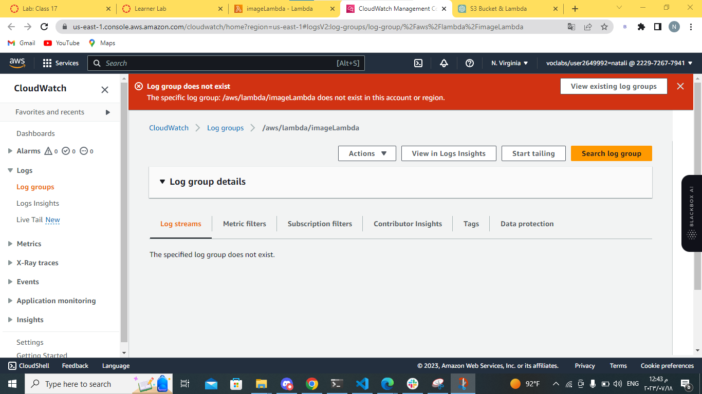
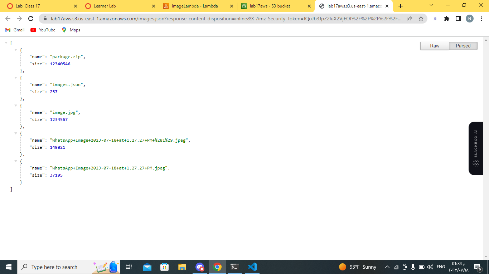

## a description of how to use your lambda.
This AWS Lambda function is designed to handle image uploads to an S3 bucket and manage a JSON file (images.json) containing metadata for all the uploaded images. When a new image is uploaded to the S3 bucket. 
_ _ _
## a description of any issues you encountered during deployment of this lambda.
i faced this issue ,the same error that appeared in the lecture,but i used chat gpt to find the solution ,it gives me another steps to follow,at the end ,the problem solved.

_ _ _
this image is screen shoot to the images.json file .

URL: https://2u.pw/NCq7Ukh

_ _ _
these are the url of images that i published on s3.

.jpeg)
